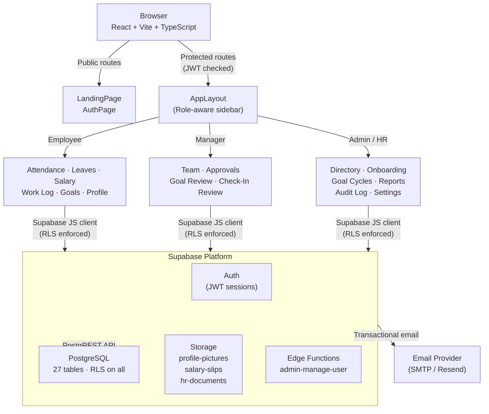

# AtombergHR

> **Enterprise HR & Operations Platform** — A single system that connects people, work, and accountability, designed for leaders who need operational clarity at scale.

[](https://atomberghr.vercel.app)
[](https://react.dev)
[](https://supabase.com)
[](https://www.typescriptlang.org)
[](https://vitejs.dev)

---

## What is AtombergHR?

AtombergHR is a full-stack, enterprise-grade Human Resource Management System (HRMS) built to consolidate all people operations into one secure, real-time platform. It replaces fragmented spreadsheets and disconnected tools with a unified system covering attendance, leave, payroll visibility, goal tracking, and team productivity — all governed by role-based access control and row-level security.

**Designed for three roles:**
- 🧑‍💼 **Employees** — Self-service portal for attendance, leaves, salary, goals, and daily work logs
- 👔 **Managers** — Team oversight, approvals, check-in reviews, and performance tracking
- 🛡️ **Admins / HR** — Full workforce management, payroll, onboarding, and analytics

---

## Features

### 🕐 Attendance Management
- Real-time punch-in / punch-out with live session timer
- Automatic daily attendance status computation (Present, Absent, Half Day, Late, WFH)
- Monthly summary cards: Present Days, Half Days, Monthly Hours, Avg Hours/Day
- Multi-session support per day with session consolidation
- Attendance regularization request and approval workflow

### 🗓️ Leave Management
- Multi-type leave applications: Annual, Sick, Casual, Maternity, Paternity, Unpaid
- Manager approval workflow with inline accept/reject
- Leave balance tracking and YTD history
- Holiday calendar with Public, Optional, and Restricted holiday types

### 💰 Salary & Payroll Visibility
- Month-wise payslip history with downloadable PDF links
- Salary breakdown: Basic, HRA, Special Allowance, PF, TDS, Net Pay
- Year-to-date earnings tracker
- Secure salary-slips storage bucket with employee-scoped access

### 📋 Work Log System
- Weekly task logging with categories: Meeting, Development, Support, Review, etc.
- Manager review and approval workflow with rework/comment loop
- Team work log review dashboard for managers
- Work log analytics with time distribution charts

### 🎯 Goal Setting & Tracking (OKR-style)
- **Goal Cycles** — Annual cycles with quarterly check-in windows (Q1–Q4)
- **Thrust Areas** — Configurable goal categories (Sales, Operations, Quality, etc.)
- **Goal Sheets** — Employee-created goal sheets with weightage validation (must total 100%)
- **UoM Types** — 4 measurement modes: Higher-is-Better, Lower-is-Better, Timeline, Zero-Target
- **Manager Approval** — Approve / Return-for-Rework with written feedback
- **Quarterly Check-Ins** — Employees log actual progress; scores computed automatically
- **Shared Goals** — Admin pushes KPI goals to multiple employees simultaneously
- **Achievement Report** — Full Excel export (per-goal + employee summary, Q1–Q4 scores)
- **Check-In Dashboard** — Real-time charts: completion rates, score distribution, department radar, top performers
- **Goal Audit Log** — Field-level change history for every post-approval edit or unlock

### 👥 Employee Directory & Profiles
- Searchable, filterable employee directory with department grouping
- Full employee profile: personal info, bank details, emergency contacts, documents
- Manager hierarchy with org chart relationships
- Bulk upload via CSV template

### 🚀 Onboarding & Offboarding
- Structured onboarding task checklists with status tracking
- Offboarding workflow with clearance steps and asset return

### 📢 Announcements & Appreciations
- Role-targeted announcements (Employee / Manager / Admin)
- Priority levels: Low, Normal, High, Urgent
- Peer appreciation and recognition feed

### 🔔 Notifications & Email
- In-app notification centre for all workflow events
- Transactional email triggers for: leave approvals, goal submission, goal approval, rework requests, check-in reminders, shared goal assignments

### 🔐 Security
- Supabase Auth with JWT session management
- Row Level Security (RLS) on all 27 database tables
- Role-based route protection in the React frontend
- Helper functions `user_employee_id()` and `user_role()` used consistently across all RLS policies
- Environment variable isolation — no secrets in source code

---

## Tech Stack

| Layer | Technology |
|---|---|
| Frontend | React 18, TypeScript, Vite 5 |
| UI Components | shadcn/ui, Radix UI primitives |
| Styling | Tailwind CSS |
| State / Data Fetching | TanStack Query (React Query) |
| Backend / Database | Supabase (PostgreSQL + PostgREST) |
| Auth | Supabase Auth (email/password) |
| Storage | Supabase Storage (profile pictures, payslips, documents) |
| Charts | Recharts |
| Excel Export | SheetJS (xlsx) |
| Deployment | Vercel |

---

## Architecture



### Database Schema (27 tables)

```
Core HR
├── hr_employees          — Employee profiles and auth link
├── hr_employee_details   — Extended personal / bank / emergency info
├── hr_attendance         — Daily punch records with session support
├── hr_leaves             — Leave applications and balances
├── hr_salary             — Monthly payroll records
├── hr_holidays           — Company holiday calendar
├── hr_documents          — Employee document store
├── hr_announcements      — Role-targeted announcements
├── hr_appreciations      — Peer recognition entries
├── hr_notifications      — In-app notification queue
├── hr_onboarding         — Onboarding task checklists
├── hr_offboarding        — Offboarding clearance steps
├── hr_contacts           — Emergency and personal contacts

Work Log
├── hr_work_log_weeks     — Weekly log header with approval status
└── hr_work_log_tasks     — Individual daily task entries

Goal Module
├── hr_goal_cycles        — Annual cycles with Q1–Q4 window dates
├── hr_thrust_areas       — Goal categories / KPI buckets
├── hr_goal_sheets        — Per-employee goal sheet per cycle
├── hr_goals              — Individual goals with UoM and targets
├── hr_shared_goals       — Admin-pushed shared KPI goals
├── hr_goal_checkins      — Quarterly actual progress entries
├── hr_checkin_comments   — Manager feedback per quarter
└── hr_goal_audit_log     — Field-level change history (post-approval)
```

---

## Getting Started

### Prerequisites
- Node.js 18+
- A [Supabase](https://supabase.com) account (free tier is sufficient)

### 1. Clone the repository

```bash
git clone https://github.com/your-org/AtombergHR.git
cd AtombergHR
npm install
```

### 2. Configure environment

```bash
cp .env.example .env.local
```

Edit `.env.local`:

```env
VITE_SUPABASE_URL=https://your-project.supabase.co
VITE_SUPABASE_PUBLISHABLE_KEY=your-anon-public-key
```

### 3. Set up the database

Run these 4 SQL scripts **in order** in your Supabase SQL Editor:

| Script | Location | What it creates |
|---|---|---|
| `01_base_hr_schema.sql` | `supabase/migrations/complete/` | 17 core HR tables + helper functions + storage bucket |
| `02_work_log_schema.sql` | `supabase/migrations/complete/` | 2 work log tables with triggers |
| `03_goal_module_schema.sql` | `supabase/migrations/complete/` | 8 goal tables + 7 seeded thrust areas |
| `04_missing_tables_patch.sql` | `supabase/migrations/complete/` | Attendance, salary, leaves, holidays, announcements, documents |

### 4. Create your first Admin user

**a)** In Supabase Dashboard → **Authentication → Users → Add user** — create with your email and a strong password.

**b)** In **SQL Editor**, run:

```sql
INSERT INTO public.hr_employees (
  user_id, full_name, email, role, status, employee_code, date_of_joining
)
VALUES (
  (SELECT id FROM auth.users WHERE email = 'your-email@example.com'),
  'Your Name', 'your-email@example.com', 'Admin', 'Active', 'ATM001', CURRENT_DATE
);
```

### 5. Run locally

```bash
npm run dev
# App starts at http://localhost:8080
```

---

## Demo Credentials

| Role | Email | Password |
|---|---|---|
| Admin / HR | `admin@atomberghr.demo` | `Admin@123` |
| Manager | `manager@atomberghr.demo` | `Manager@123` |
| Employee | `employee@atomberghr.demo` | `Employee@123` |

---

## Project Structure

```
src/
├── components/
│   ├── auth/           — ProtectedRoute with role guards
│   ├── goals/          — GoalWeightageBar, StatusBadges, UoMScoreDisplay,
│   │                     QuarterSelector, CheckInWindowBanner
│   └── layout/         — AppLayout, AppSidebar, TopBar, Footer
├── contexts/
│   └── AuthContext.tsx — Global auth state
├── hooks/
│   └── useGoals.ts     — Complete React Query hook library (30+ hooks)
├── integrations/
│   └── supabase/       — Auto-generated types + client
├── lib/
│   └── emailService.ts — All transactional email triggers
├── pages/
│   ├── hr/             — Admin pages (Directory, Goal Cycles, Dashboard, Reports…)
│   ├── manager/        — Manager pages (Team, Approvals, Check-In Review…)
│   └── [employee pages]— Attendance, Leaves, Goals, Work Log, Salary…
└── types/
    └── goals.ts        — TypeScript interfaces + score computation logic
```

---

## Deployment

### Vercel (recommended)

```bash
npm install -g vercel
vercel login
vercel --prod --name atomberghr
```

Add environment variables in **Vercel Dashboard → Project → Settings → Environment Variables**:

| Key | Value |
|---|---|
| `VITE_SUPABASE_URL` | your Supabase project URL |
| `VITE_SUPABASE_PUBLISHABLE_KEY` | your Supabase anon/public key |

Redeploy after adding variables.

The `vercel.json` in the project root handles SPA routing automatically.

---

## Security Model

All data access is governed by **Row Level Security (RLS)** at the PostgreSQL level — the frontend cannot bypass it regardless of client-side logic.

```
Employee → Can only read/write their own rows
Manager  → Can read their direct reports' rows (via manager_id join)
Admin    → Full access via user_role() = 'Admin' check
```

Two PostgreSQL helper functions are used in every RLS policy:

```sql
public.user_employee_id()  -- returns UUID of current user's hr_employees row
public.user_role()         -- returns 'Employee' | 'Manager' | 'Admin'
```

---

## Regenerating TypeScript Types

After running new migrations, regenerate the Supabase types:

```bash
npx supabase gen types typescript --project-id YOUR_PROJECT_ID \
  > src/integrations/supabase/types.ts
```

---

## License

MIT © AtombergHR